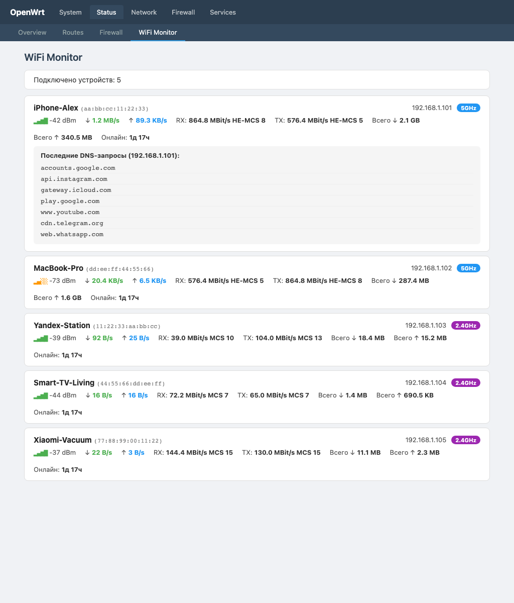

# luci-app-wifimon

Real-time WiFi client monitor for OpenWrt LuCI.

Shows all devices currently connected to your WiFi access points with live traffic stats and DNS query history.



## Features

- **Real-time client list** — displays devices actually connected to WiFi (via `iw station dump`), not just DHCP leases
- **Live speed monitoring** — download/upload speed per client, updated every 3 seconds
- **Signal strength** — dBm values with color-coded signal indicator
- **Connection details** — TX/RX bitrate, MCS index, total traffic, uptime
- **Band indicator** — 2.4GHz / 5GHz badges
- **DNS query history** — click on any client to see last 15 DNS queries (domains the device has been connecting to)
- **Hostname resolution** — resolves device names from DHCP leases

## Requirements

- OpenWrt 24.10+ with LuCI
- `dnsmasq-full` with `logqueries` enabled (for DNS history feature)

## Installation

SSH into your router and run:

```bash
# Create directories
mkdir -p /www/luci-static/resources/view/wifimon /tmp/wifimon

# Download files
REPO="https://raw.githubusercontent.com/denied1011/luci-app-wifimon/main"
wget -O /usr/libexec/rpcd/wifimon "$REPO/rpcd/wifimon"
wget -O /usr/share/rpcd/acl.d/luci-app-wifimon.json "$REPO/acl/luci-app-wifimon.json"
wget -O /usr/share/luci/menu.d/luci-app-wifimon.json "$REPO/menu/luci-app-wifimon.json"
wget -O /www/luci-static/resources/view/wifimon/clients.js "$REPO/view/wifimon/clients.js"

# Set permissions and restart rpcd
chmod +x /usr/libexec/rpcd/wifimon
/etc/init.d/rpcd restart
```

Then open LuCI and navigate to **Status → WiFi Monitor**.

### Enable DNS query logging (optional)

To see DNS history per client, enable dnsmasq query logging:

```bash
uci set dhcp.@dnsmasq[0].logqueries='1'
uci commit dhcp
/etc/init.d/dnsmasq restart
```

## Uninstall

```bash
rm -f /usr/libexec/rpcd/wifimon
rm -f /usr/share/rpcd/acl.d/luci-app-wifimon.json
rm -f /usr/share/luci/menu.d/luci-app-wifimon.json
rm -rf /www/luci-static/resources/view/wifimon
rm -rf /tmp/wifimon
/etc/init.d/rpcd restart
```

## File structure

```
/usr/libexec/rpcd/wifimon                          # rpcd backend script
/usr/share/rpcd/acl.d/luci-app-wifimon.json        # ACL permissions
/usr/share/luci/menu.d/luci-app-wifimon.json       # LuCI menu entry
/www/luci-static/resources/view/wifimon/clients.js  # Frontend (LuCI JS view)
```

## How it works

- **Client detection**: Uses `iw dev <interface> station dump` to get actually connected WiFi stations (not DHCP leases)
- **Speed calculation**: Tracks TX/RX byte counters between polling intervals to calculate real-time throughput
- **DNS history**: Parses dnsmasq query logs from syslog (`logread`) to extract per-client domain queries
- **Frontend**: LuCI JavaScript view with 3-second auto-refresh polling via ubus RPC

## License

MIT
